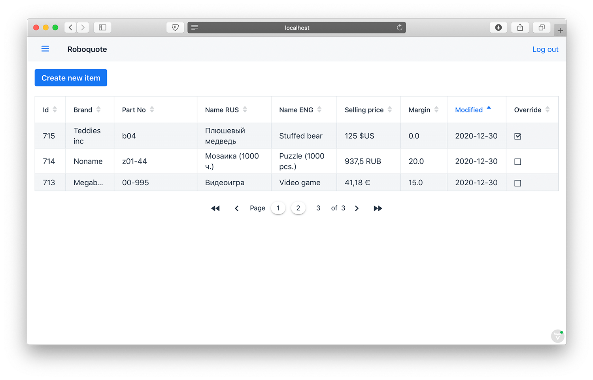
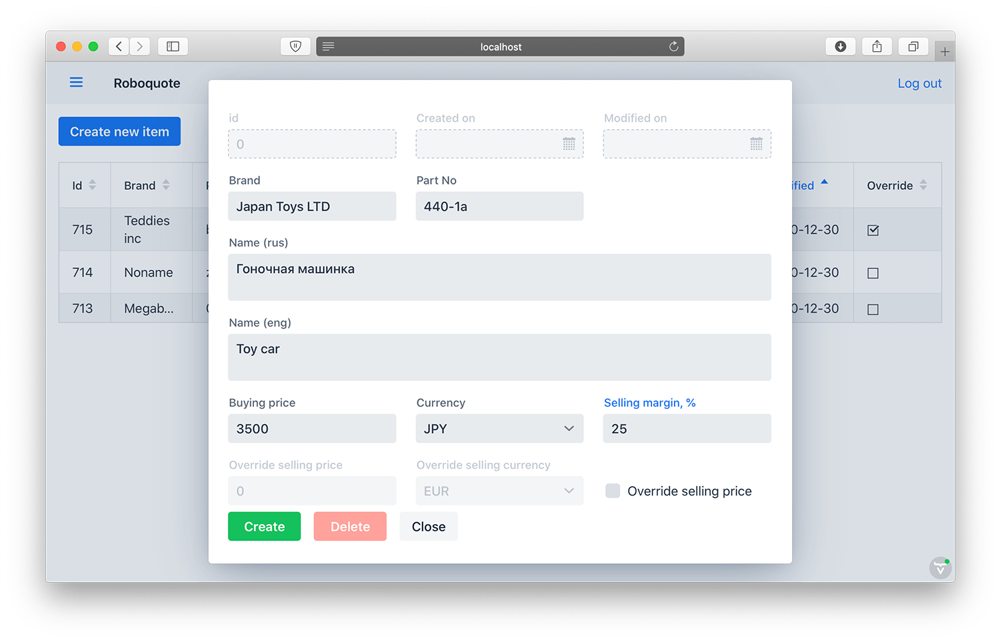
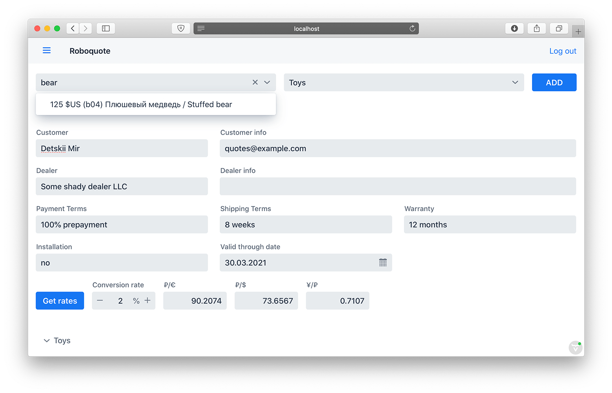
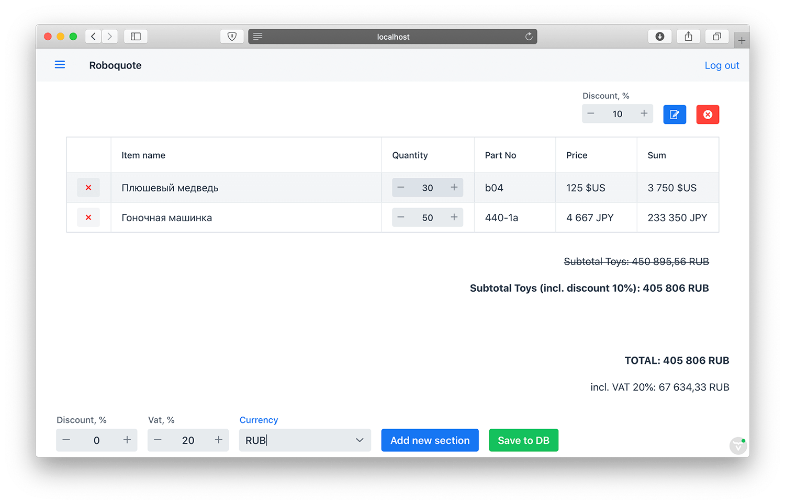
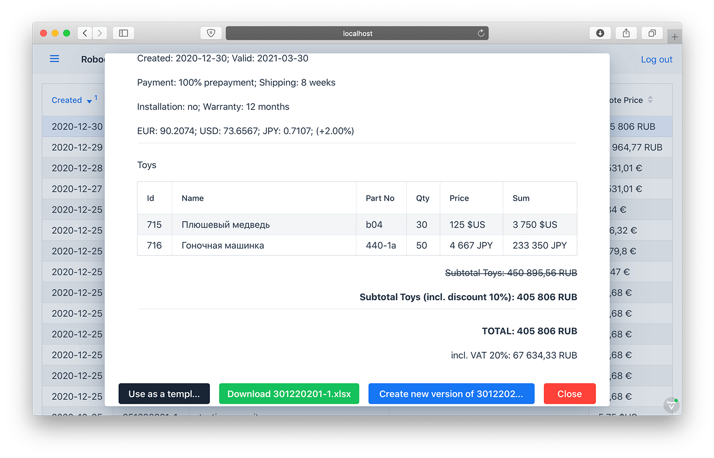

##Roboquote 
Roboquote is a petproject webapp made for easy generation of commercial quotes (proforma invoices) and keeping related 
data for small business. App contains three modules:  

 + **Item service** - a REST service app (Spring framework 5.2.9) with all available inventory, along with buying prices, 
 margins and/or plain selling 
 prices.
 + **Quote service** - a REST service (Spring boot 2.3.5) with all created quotes, quote sections and item postions. 
 Service generates ref.numbers for quotes, and keeps all related data (customer, dealer, contacts, payment details, 
 currency rates, markups, discounts, etc). Quote service also generates MS Office files for sending in an email, 
 printing, etc.  
 + **Front service** - front-end Vaadin app (Spring boot 2.3.5, Vaadin 14.4.2), with user-friendly UI. Allows performing 
 CRUD operations for quotes and inventory items.  
 
 All modules use Spring security with bcrypt password encryption; services prohibit direct unauthenticated access to 
 data through http-requests.  
 
 App is capable of working with several currencies within one quote: user just selects the desired currency the quote 
 should be generated with and all prices are converted using exchange and cross rates. The built-it currencies are RUB, 
 EUR, USD and JPY. The app takes the current exchange rates (in relation to RUB) from Russia's Central Bank, www.cbr.ru. 
 Roboquote offers to adjust a conversion fee or simply overriding currency rates. The default fee is 2%. 
 

_Inventory panel_

_New item form_

_New quote form. Find item, get rates, fill info._

_Manage quote contents._

_Quote viewer_
